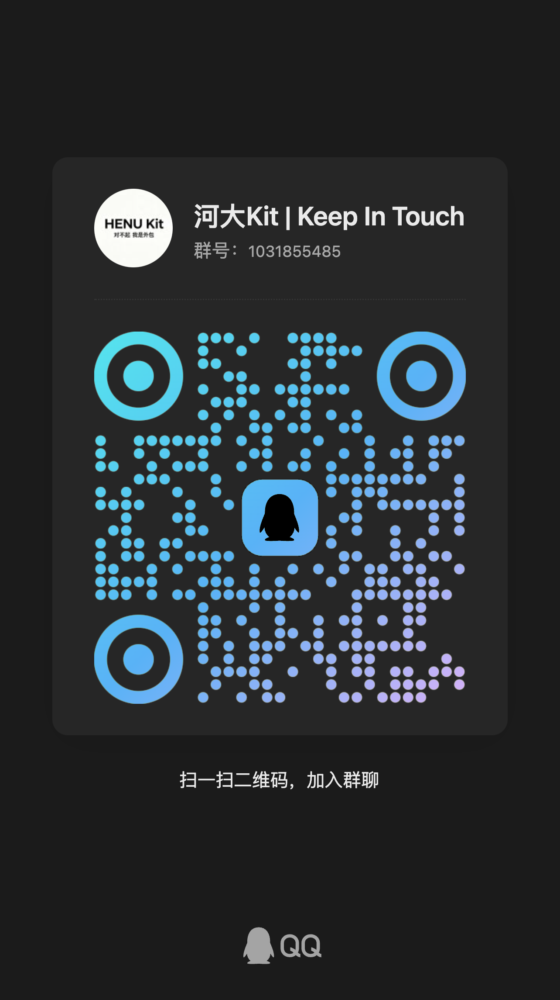

# 河南大学校园助手

面向河南大学学生的校园工具集合，覆盖空教室查询、课表查询、图书馆座位预约、研讨室预约、河宝社区查询等场景。
毒瘤名单：
- [x] 今日校园
- [x] 喜鹊
- [ ] 多彩校园/水满分
- [ ] 体适能

加q群直接体验部署版。1031855485


## 选择版本

| 版本 | 分支 | 适合场景 |
| --- | --- | --- |
| Langbot 插件 | `langbot-plugin` | 接入 Langbot 机器人，按 QQ 隔离账号数据 |
| MCP 服务器 | `mcp-server` | 接入支持 MCP 的客户端或做二次集成 |
| OpenClaw Skill | `openclaw-skill` | 在 OpenClaw 中用自然语言调用 |

## 快速开始

Langbot 插件：

```bash
git clone -b langbot-plugin https://github.com/jry21223/HENU_Assistant.git
cd HENU_Assistant
python3 -m venv .venv
.venv/bin/pip install -r requirements.txt
.venv/bin/lbp build
```

MCP 服务器：

```bash
git clone -b mcp-server https://github.com/jry21223/HENU_Assistant.git
cd HENU_Assistant
python3 -m venv venv
source venv/bin/activate
pip install -r requirements.txt
python3 mcp_server.py --transport stdio
```

OpenClaw Skill：

```bash
git clone -b openclaw-skill https://github.com/jry21223/HENU_Assistant.git henu_campus_assistant
cp -r henu_campus_assistant ~/.openclaw/workspace/skills/
```

## 功能

- 账号绑定与本地加密保存
- 课表同步、当前课程、日课表、周课表查询
- 图书馆区域查询、座位预约、当前预约、历史记录、签到、取消
- 研讨室筛选、房间详情、分组、预约、签到、取消
- 河宝社区请假、签到、查寝、活动、信息收集查询

## 文档

- [河南大学选课接口记录](docs/course-selection-api.md)
- [河南大学校园相关 API 汇总](docs/school-api-summary.md)

## 说明

- 需要河南大学学生账号和可访问校园相关系统的网络环境。
- 所有校园 API 文档已集中放在本仓库 `repo/docs/` 目录，统一入口见仓库文档列表。
- 账号、Cookie、缓存文件保存在本地，不上传到第三方服务。
- 本项目仅供学习和个人使用，请遵守学校相关规定。

## 免责声明

- 本仓库整理的接口与参数仅用于个人学习、调试和非生产环境验证，不得用于任何违反法律法规、院校管理制度或平台服务条款的行为。
- API 均为公开系统交互路径与调用方式，可能因学校服务更新而变化，不保证稳定可用。
- 请勿将本仓库用于代替官方系统的正式业务审批流程，涉及正式身份认证、成绩、选课、财务等敏感操作请以官方渠道为准。

## 许可证

MIT License，见 [LICENSE](LICENSE)。
